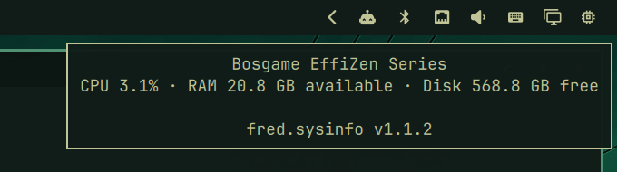
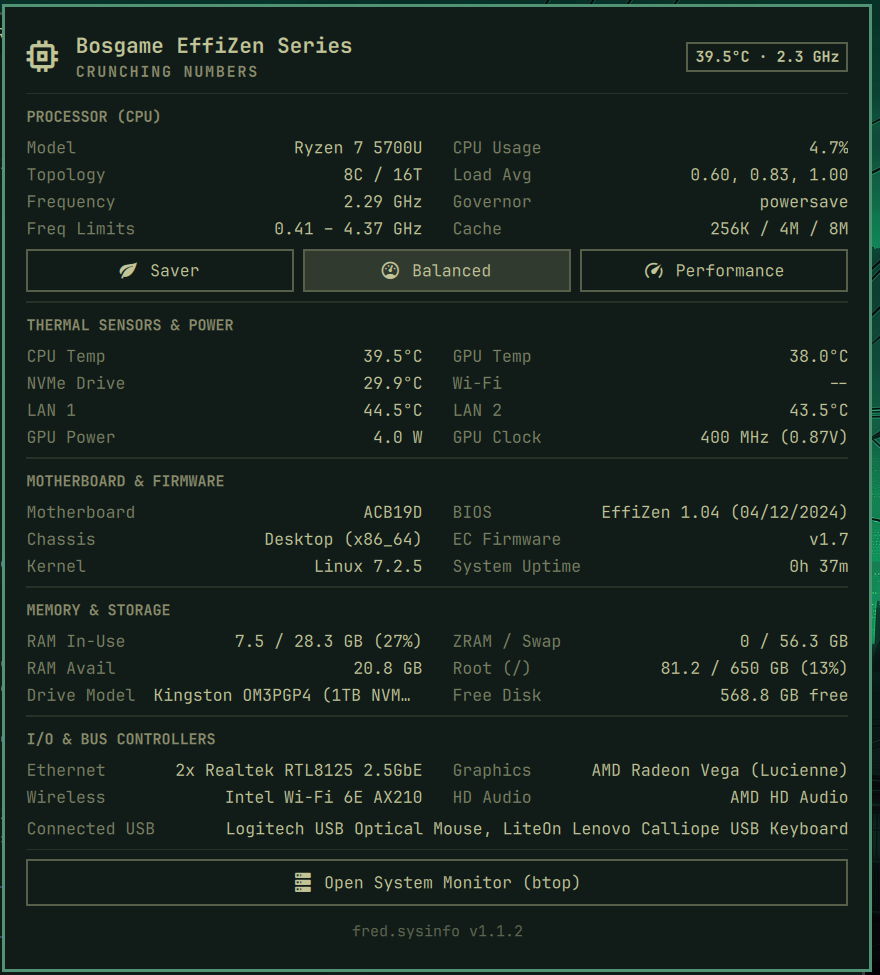

# System Information & Hardware Monitor (`fred.sysinfo`)

Comprehensive hardware telemetry, thermal sensors, and system information bar plugin for Tamlinux (Hyprland + Quickshell).





---

## Overview

`fred.sysinfo` provides a clean, responsive top-bar widget and popout panel displaying detailed, real-time hardware telemetry and system specifications. It replaces vendor-locked or static hardware widgets with a universal, dynamic Linux kernel probe reading directly from standard `sysfs`, `procfs`, and PCI interfaces.

| Category | Telemetry & Details Displayed |
| :--- | :--- |
| **Processor (CPU)** | Dynamic model, cores/threads topology, real-time frequency, min/max frequency limits, CPU utilization %, load averages, multi-level cache hierarchy, CPU governor, and power profile controls. |
| **Thermals & Power** | Dynamic multi-vendor thermal mapping (AMD `k10temp`, Intel `coretemp`, NVMe drives, GPU junction/edge, Wi-Fi, Ethernet) and GPU wattage, clock frequency, and voltage. |
| **Motherboard & Firmware** | System vendor, product series, motherboard model, BIOS version, BIOS release date, EC firmware, chassis classification, kernel release, and formatted system uptime. |
| **Memory & Storage** | RAM total, in-use, and available; ZRAM and swap usage; active root disk drive model and root filesystem (`/`) capacity and utilization. |
| **I/O & Bus Controllers** | Dynamically classified Ethernet controllers, Wi-Fi adapter, GPU/VGA controller, HD audio coprocessor, and connected USB peripheral devices. |
| **Actions & Controls** | One-click power profile switching (`power-saver`, `balanced`, `performance`), click-to-copy for any hardware value, and quick launch for terminal system monitors (`btop`). |

---

## Features

- **Universal Dynamic Probing:** Pure standard-library Python engine (`sysinfo-probe.py`) querying native Linux interfaces (`/sys`, `/proc`, `/usr/bin/lspci`), eliminating hardcoded vendor strings.
- **Stateful CPU Sampling:** A private cache holds the previous CPU counters so polls spaced at least 50 ms apart can calculate usage without a second sample delay.
- **Marketplace Security Hardening:**
  - Subprocesses run inside a strictly closed environment (`clearEnvironment: true`) with whitelisted variables (`PATH`, `HOME`, `LC_ALL`, `XDG_RUNTIME_DIR`, `XDG_CACHE_HOME`).
  - Helper paths resolve canonically via descriptor URLs (`Qt.resolvedUrl`).
  - Execution watchdog timers automatically terminate hung processes.
  - Input collectors enforce payload caps to prevent unbounded memory allocation.
  - Safe clipboard copy invokes `wl-copy` without shell string interpolation vulnerabilities.
- **Interactive Power Management:** Toggle system power profiles directly between Saver, Balanced, and Performance modes via `powerprofilesctl`.
- **Fresh Resource Summary:** Hover over the bar icon for current CPU usage, available RAM, and free root-disk space without opening the full panel.
- **System Monitor Integration:** Launch `btop` in your configured terminal with a single click from the panel footer.

## Security model and cache

The probe stores CPU counters and static hardware details under `$XDG_RUNTIME_DIR/fred.sysinfo`, or `$XDG_CACHE_HOME/fred.sysinfo` when no runtime directory is available. It creates the directory with mode `0700` and refuses caching unless it is owned by the current user and private. It never caches directly in shared `/dev/shm` or `/tmp`.

Each write creates an unpredictable `0600` temporary file using `O_EXCL` and `O_NOFOLLOW`, then atomically renames it relative to an open directory descriptor. Reads also use `O_NOFOLLOW` and validate owner, file type, mode, size, and age on the opened descriptor. A rejected cache leaves live telemetry available. Cache security tests run with `python3 -m unittest discover -s tests`.

---

## Requirements

- Tamlinux (or Arch Linux base with Hyprland and Quickshell)
- Python 3 (`python3`, standard library only)
- `pciutils` (`/usr/bin/lspci` for hardware bus controller identification)
- `power-profiles-daemon` (`powerprofilesctl` for platform power management)
- `wl-clipboard` (`wl-copy` for click-to-copy interactions)

---

## Installation

Install and enable the plugin directly using Omarchy's plugin manager:

```bash
omarchy plugin add https://github.com/greenermoose/sysinfo-fred-tamlinux.git --enable
```

### Adding to Bar Layout

If your bar configuration does not automatically position new widgets, add `fred.sysinfo` to the `right` section of `~/.config/omarchy/shell.json`:

```json
{
  "bar": {
    "layout": {
      "right": [
        { "id": "omarchy.tray" },
        { "id": "omarchy.network" },
        { "id": "omarchy.audio" },
        { "id": "omarchy.monitor" },
        { "id": "fred.sysinfo" }
      ]
    }
  }
}
```

Reload the shell to apply:

```bash
omarchy-shell shell rescanPlugins
```

---

## Interacting with the Plugin

- **Bar Widget:** Displays a chip icon (`󰍛`). Hovering shows a tooltip summary containing your computer model, CPU temperature, and live frequency.
- **Click Bar Icon:** Toggles the full hardware information panel.
- **Click Any Value:** Copies the specification or metric directly to your clipboard.
- **Power Buttons:** Click *Saver*, *Balanced*, or *Performance* to switch power profiles immediately.
- **Open System Monitor:** Launches `btop` terminal monitor.

---

## CLI Probe Testing

You can run the underlying telemetry engine directly from the command line:

```bash
# Formatted JSON output
python3 ~/.config/omarchy/plugins/fred.sysinfo/sysinfo-probe.py | jq .

# Performance benchmark
python3 ~/.config/omarchy/plugins/fred.sysinfo/sysinfo-probe.py --bench
```

---

## Uninstallation

To remove the plugin:

```bash
omarchy plugin remove fred.sysinfo
```

---

## License

GNU General Public License v3.0 or later ([LICENSE](LICENSE)).
